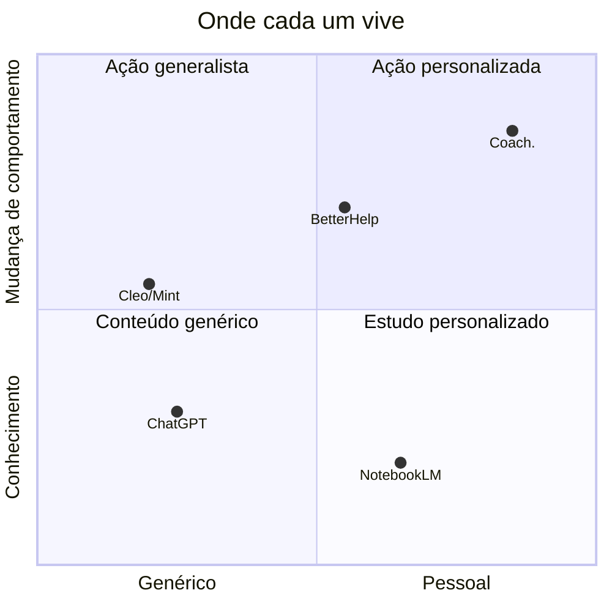
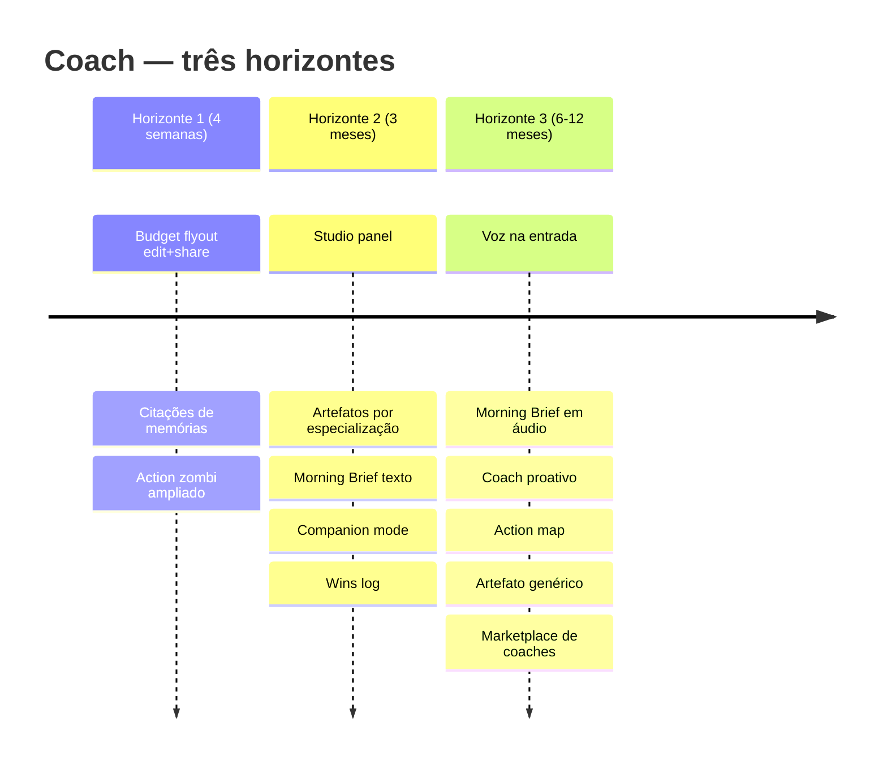

# Coach. — Roadmap de Produto

## Posicionamento em uma frase

**Coach é apoio motivacional contínuo pra resolver problemas em qualquer área da vida** — finanças, saúde, fitness, aprendizado, projetos. A pessoa fala, o agente cobra, lembra, comemora. O contrário de ChatGPT (esquece) e de NotebookLM (estuda). Aqui a gente **age**.

## Onde Coach se posiciona

O eixo vertical é o que mais importa: **a maioria das ferramentas de IA mora embaixo (geram conhecimento)**. Coach mora em cima, onde a IA cobra ação e segue você no tempo. À direita (pessoal) porque tudo é ancorado na sua vida específica — não em conteúdo de treinamento.

## Filosofia: o que tomamos emprestado do NotebookLM e o que reframamos

NotebookLM consolidou primitivos úteis pra ferramentas de IA. Mas o produto deles é **educacional** (estude esse documento). O Coach é **motivacional** (resolva esse problema). Os primitivos têm que ser adaptados, não copiados.

| Primitivo NotebookLM | Tradução pro Coach | Por quê |
|---|---|---|
| **Sources** (PDFs, links, áudios) | **Memories + Whys + Worries** (fatos consolidados da vida do user) | Coach não estuda documentos externos — usa o histórico declarado do user |
| **Studio com artefatos** | **Workspace com Plano, Budget, Memórias** | Conceitualmente igual: painel com objetos persistidos, editáveis, compartilháveis |
| **Citations inline** | "Você me disse em :data que..." | Toda recomendação ancorada no que o user já declarou — não conselho genérico |
| **Audio overview / Podcast** | **Morning Brief** — voz do agente lendo o que importa hoje | Mesmo formato (long-form audio), conteúdo distinto (plano + cobrança + win recente) |
| **Mind Map** | **Action map** (talvez) — clusters e dependências entre ações | Só faz sentido com 30+ ações; baixa prioridade |
| **Study Guide / FAQ** | _Não traduz_ | Coach não é tutorial. Skip. |

## O que já está em produção (provas)

| Camada | Feature | Status |
|---|---|---|
| Conversação | Agente bilíngue (pt-BR/en) com especialização por área (finance/legal/emotional/health/fitness/learning) | ✓ |
| Conversação | Goals como workspaces — cada área é um chat separado, com memória própria | ✓ |
| Conversação | Tips contextuais — 11 nudges automáticos no topo do chat baseados em estado | ✓ |
| Plano | Actions com status/prioridade/prazo + flyout pra revisar/concluir/adiar | ✓ |
| Plano | Auto-close de actions zombis quando ação correlata é completada | ✓ |
| Memória | RememberFact + RecallFacts — agente salva e busca fatos de longo prazo | ✓ |
| Memória | LogWhy + LogWorry — captura motivações declaradas e preocupações | ✓ |
| Financeiro | Planejador Financeiro de 4 caixas (BudgetSnapshot tool com buffer de 15%) | ✓ |
| Financeiro | Budget como contexto de vida — visível em qualquer goal (não só finanças) | ✓ |
| Financeiro | Budget flyout read-only (PR aberto) | 🚧 |
| Comunicação | Webhook de WhatsApp/email — usuário fala em qualquer canal, agente lembra | ✓ |
| Comunicação | ShareViaEmail — agente envia plano/orçamento pra terceiros (contador, parceiro) | ✓ |
| Comunicação | Share via ícone — botão em cada resposta do agente pra compartilhar uma específica | ✓ |
| Multi-tenant | Isolamento por user em todas as tabelas via global scope | ✓ |
| Multi-tenant | Convites por email pra novos users; registro fechado | ✓ |
| Operação | Cron de lembrete mensal de orçamento | ✓ |
| Operação | PWA + mobile-first UI | ✓ |

## Roadmap

### Horizonte 1 — Próximas 4 semanas (motor que já está girando)

| Feature | Por quê importa | Status |
|---|---|---|
| Budget flyout — edição inline com recálculo automático | User pode atualizar renda/gastos sem voltar pro chat. Reduz fricção mensal. | Stage 2 desta semana |
| Budget flyout — botão "Partilhar" interno | Pra mandar o budget atualizado pro contador/parceiro sem reformular. | Stage 3 desta semana |
| Citações inline pra memórias | Quando o agente diz "considerando sua renda de R$ 25k", aparece `[memória]` clickável. Aumenta confiança. | Próxima sprint |
| Action zombi detector ampliado | Hoje fecha "criar orçamento"; ampliar pra outras pendências paradas há semanas. | Próxima sprint |

### Horizonte 2 — Próximos 3 meses (consolidação)

| Feature | Por quê importa | Posicionamento |
|---|---|---|
| **Studio panel** — Plano + Budget + Memórias em um único painel | Hoje são 3 flyouts separados. Studio = padrão visual do NotebookLM, adaptado: o user tem **uma** vista da própria vida. | NotebookLM-flavored |
| **Artefatos por especialização** — Health snapshot, Fitness baseline, Learning tracker | Cada goal ganha sua própria foto estruturada. Mesma mecânica do BudgetSnapshot, aplicada nas outras áreas. | Coach-original |
| **Morning Brief (texto)** — agente prepara "o que importa hoje" automaticamente, 7h | Substitui a hora perdida olhando notificações. Já tem cron de budget reminder; expandir. | Coach-original |
| **Companion mode** — convidar parceiro pra ver/co-gerenciar um goal específico | Saúde financeira de casal, fitness com amigo. Accountability triplica taxa de completion. | Coach-original |
| **Wins log** — agente captura wins e celebra; histórico revisitável quando o user vacila | Antídoto do efeito "só vejo o que falta" — fundamental em motivação contínua. | Coach-original |

### Horizonte 3 — Próximos 6-12 meses (vantagem de longo prazo)

| Feature | Por quê importa | Posicionamento |
|---|---|---|
| **Voz na entrada** — gravar mensagem em vez de digitar | Maior cenário de uso real: indo no carro, no banho, na caminhada. Texto = barreira. | Coach-original |
| **Morning Brief em áudio** — o "podcast pessoal" diário do user | Igual ao audio overview do NotebookLM, mas conteúdo é a vida do user, não um PDF. | NotebookLM-flavored |
| **Coach proativo** — check-ins agendados baseados em padrões detectados | "Sumiu 5 dias do fitness, tá tudo bem? Quer pausar formalmente?" Vai além do reativo. | Coach-original |
| **Action map** — visualização de clusters/dependências quando o user tem 30+ ações | Só vale com volume suficiente; visualiza onde tá empacado vs onde flui. | NotebookLM-flavored |
| **Artefato genérico (table tool)** — primitivo reusável pra novos tipos de structured artifact | Só depois de 3-4 hand-coded (Budget, Health, Fitness, etc) mostrando o mesmo shape. Pré-extração = abstração errada. | Engenharia |
| **Marketplace de coaches** — coaches humanos verificados podem usar a plataforma | Hybrid AI + humano. Receita B2B. Diferencia de Cleo/ChatGPT que são puro software. | Modelo de negócio |

## Diferenciação competitiva detalhada

| | Coach. | ChatGPT | NotebookLM | BetterHelp | Cleo |
|---|---|---|---|---|---|
| **Tracking de ações ao longo do tempo** | sim | não | não | semanal | alertas |
| **Memória de longo prazo da vida do user** | sim | curta | docs externos | por sessão | não |
| **Multi-área (saúde + dinheiro + projetos)** | sim | genérico | docs | só mental | só dinheiro |
| **Cobrança proativa (agente puxa)** | sim (cron) | não | não | profissional | alertas |
| **Compartilhamento estruturado** | sim (ShareViaEmail) | não | parcial | não | não |
| **Privacidade** | dados do user em conta própria | nuvem aberta | nuvem aberta | nuvem aberta | nuvem aberta |
| **Custo recorrente** | baixo (IA é insumo, não produto) | $20/mês | grátis | $260/mês | $5/mês |

## Non-goals — o que Coach **não** é

| Não é | Por que recusar |
|---|---|
| **Plataforma de estudo / pesquisa** | É o que NotebookLM faz. Coach pega o que aprende e transforma em ação. |
| **Substituto de terapia** | Coach reconhece quando é caso de profissional e redireciona (CVV 188 pra crises). |
| **Agregador financeiro / Open Banking** | Não conecta com bancos. User descreve, agente reflete. Privacidade > automação. |
| **Rede social** | Single-user. Companion mode é convite pontual, não feed. |
| **Knowledge base genérica** | Sem conselho fiscal específico, médico específico, jurídico específico. Refere profissional. |
| **Tutor / e-learning** | Quando user diz "quero aprender X", agente ajuda a estruturar o caminho, não dá o conteúdo. |

## Visualização do roadmap

## Modelo de execução

- **TDD em Pest** — toda feature nova tem teste, suite inteira corre antes de merge (343+ testes verdes hoje)
- **Bilíngue desde o dia 1** — pt-BR e en em todas as chaves; nenhuma copy hardcoded
- **Multi-tenant nativo** — global scope por user em todos os modelos relevantes; testes de isolamento explícitos
- **Branch por concern, PR por concern** — diff pequeno, revisão rápida, deploy de baixo risco
- **Stack escolhida pra durar** — Laravel 13, Filament 5, Livewire 4, Pest 4, Tailwind 4. Tudo na onda atual, manutenibilidade longa

## Próxima conversa com você

Pergunta direta: **qual horizonte aprovamos primeiro?** Default: termina Horizonte 1 nas próximas 4 semanas (3 features pequenas já em curso) e, no fim do mês, conversamos sobre Studio panel (a primeira mudança estrutural).
